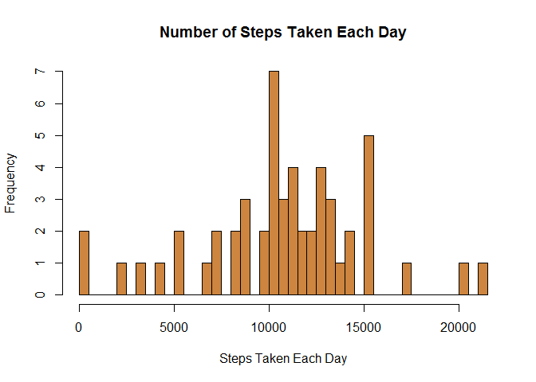
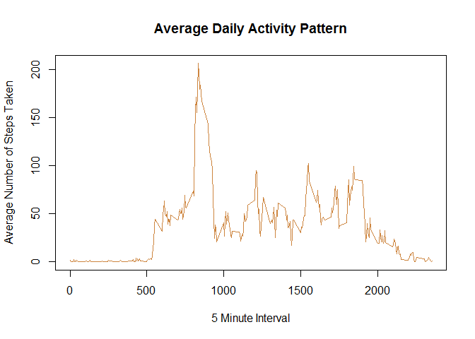
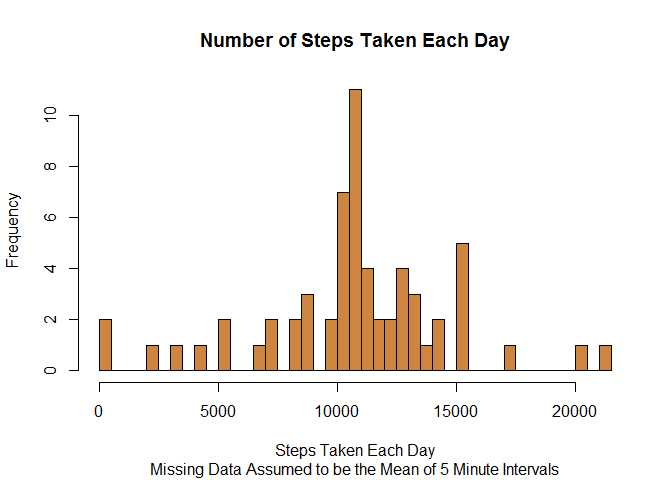
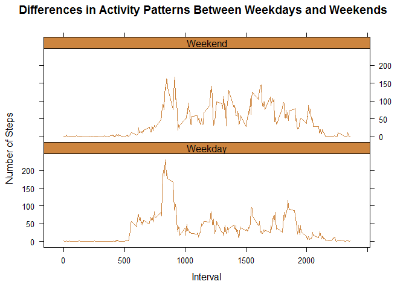

# Reproducible Research: Peer Assessment 1


Loading and preprocessing the data

```r
datafeed <- read.csv("activity.csv")
```

## What is the mean total number of steps taken per day?
**For this part of the assignment, you can ignore the missing values in the dataset.**

1. Make a histogram of the total number of steps taken each day


```r
stepstaken <- aggregate(steps~date, data=datafeed, FUN=sum)
hist(stepstaken$steps, breaks=nrow(stepstaken), main="Number of Steps Taken Each Day", xlab="Steps Taken Each Day", col="tan3")
```

 

2. Calculate and report the **mean** and **median** total number of steps taken per day


```r
mean(stepstaken$steps)
```

```
## [1] 10766
```

```r
median(stepstaken$steps)
```

```
## [1] 10765
```

## What is the average daily activity pattern?

1. Make a time series plot (i.e. `type = "l"`) of the 5-minute interval (x-axis) and the average number of steps taken, averaged across all days (y-axis)


```r
avgsteps <- aggregate(steps~interval, data=datafeed, FUN=mean)
plot(avgsteps, type="l", main="Average Daily Activity Pattern", xlab="5 Minute Interval", ylab="Average Number of Steps Taken", col="tan3")
```

 

2. Which 5-minute interval, on average across all the days in the dataset, contains the maximum number of steps?


```r
avgsteps$interval[which.max(avgsteps$steps)]
```

```
## [1] 835
```


## Imputing missing values
**Note that there are a number of days/intervals where there are missing values (coded as NA). The presence of missing days may introduce bias into some calculations or summaries of the data.**

1. Calculate and report the total number of missing values in the dataset (i.e. the total number of rows with `NA`s)


```r
sum(is.na(datafeed))
```

```
## [1] 2304
```

2. Devise a strategy for filling in all of the missing values in the dataset. The strategy does not need to be sophisticated. For example, you could use the mean/median for that day, or the mean for that 5-minute interval, etc.

3. Create a new dataset that is equal to the original dataset but with the missing data filled in.


```r
newdatafeed <- merge(datafeed, avgsteps, by="interval", suffixes=c("",".y"))
nareplace <- is.na(newdatafeed$steps)
newdatafeed$steps[nareplace] <- newdatafeed$steps.y[nareplace]
newdatafeed <- newdatafeed[,c(1:3)]
```

4. Make a histogram of the total number of steps taken each day and calculate and report the **mean** and **median** total number of steps taken per day. Do these values differ from the estimates from the first part of the assignment? What is the impact of imputing missing data on the estimates of the total daily number of steps?


```r
stepstakenall <- aggregate(steps~date, data=newdatafeed, FUN=sum)
hist(stepstakenall$steps, breaks=nrow(stepstakenall), sub="Missing Data Assumed to be the Mean of 5 Minute Intervals", main="Number of Steps Taken Each Day", xlab="Steps Taken Each Day", col="tan3")
```

 


```r
mean(stepstakenall$steps)
```

```
## [1] 10766
```

```r
median(stepstakenall$steps)
```

```
## [1] 10766
```

The impact of the missing data seems rather low, at least when estimating the total number of steps per day.


## Are there differences in activity patterns between weekdays and weekends?
**For this part the weekdays() function may be of some help here. Use the dataset with the filled-in missing values for this part.**

1. Create a new factor variable in the dataset with two levels -- "weekday" and "weekend" indicating whether a given date is a weekday or weekend day.


```r
weekdays <- weekdays(as.Date(newdatafeed$date))
datafeedwd <- transform(newdatafeed, day=weekdays)
datafeedwd$wk <- ifelse(datafeedwd$day %in% c("Saturday", "Sunday"), "Weekend", "Weekday")
```

2. Make a panel plot containing a time series plot (i.e. `type = "l"`) of the 5-minute interval (x-axis) and the average number of steps taken, averaged across all weekday days or weekend days (y-axis).


```r
weekavg <- aggregate(datafeedwd$steps, by=list(datafeedwd$interval, datafeedwd$wk), mean)
names(weekavg) <-c("interval", "dayofweek", "steps")
library(lattice)
xyplot(steps ~ interval | dayofweek, weekavg, layout = c(1, 2), type = "l", par.settings = list(strip.background=list(col="tan3")), col="tan3", main="Differences in Activity Patterns Between Weekdays and Weekends", xlab = "Interval", ylab = "Number of Steps")
```

 
